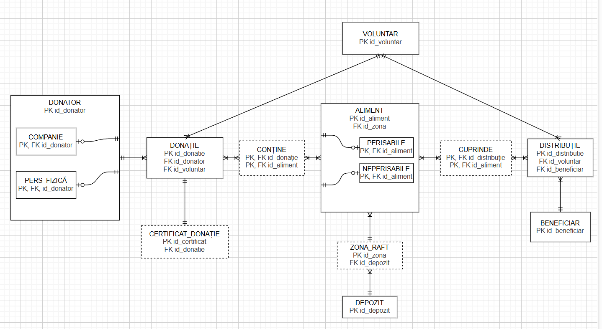

# Baza de date - Banca de alimente
Meteleanu Dorin - Gabriel, grupa 143

Proiect pentru cursul de Baze de Date - gestionarea unei bănci de alimente

## 1. Descrierea modelului real și a utilității

Această aplicație este destinată gestionării eficiente a activității unei Bănci de Alimente, având ca scop principal digitalizarea proceselor de colectare, stocare și distribuție a produselor către persoanele sau asociațiile vulnerabile.

### Reguli de funcționare:
- Sistemul permite înregistrarea`Donatorilor`, care pot fi atât persoane fizice, cât și companii.
- Donatorii inițiază `Donații`.
- Donațiile constau în diverse cantități de `Alimente`. Alimentele sunt categorisite în produse perisabile și neperisabile, pentru a permite o gestionare corectă a termenelor de valabilitate.
- Fiecare donație primită generează automat un `Certificat de Donație` unic.
- Produsele colectate sunt stocate în locații fizice (`Depozite`), având o evidență clară la nivel de `Zonă/Raft` pentru o localizare rapidă și eficientă a stocurilor.
- În final, alimentele sunt grupate în `Distribuții` și livrate către `Beneficiari` (care pot fi familii, centre de plasament, cantine sociale etc.).

## 2. Constrângeri impuse modelului prezentat

- Restricție de `unicitate` a documentelor: O donație trebuie să fie însoțită de unul și doar un singur certificat de donație (relație 1:1 obligatorie).
- Restricții de stoc logic: Cantitatea de alimente cuprinsă într-o distribuție către beneficiari nu poate depăși cantitatea totală de alimente disponibilă pe rafturile depozitelor

## 3. Descrierea entităților

- VOLUNTAR
    - Entitatea care gestionează fluxul de intrare (donații) și ieșire (distribuții).
    - Cheie primară: `id_voluntar`

- DONATOR
    - Entitate generică (părinte) pentru persoanele sau companiile care oferă resurse. Dispune de sub-entitățile (ISA) `COMPANIE` și `PERS_FIZICĂ`.
    - Cheie primară: `id_donator`

- DONAȚIE
    - Reprezintă evenimentul prin care bunurile intră în gestiunea băncii de alimente.
    - Cheie primară: `id_donatie`.

- CERTIFICAT_DONAȚIE
    - Entitate dependentă, generată ca dovadă legală a recepției bunurilor.
    - Cheie primară: `id_certificat`.

- ALIMENT
    - Reprezintă tipul de produs gestionat. Dispune de sub-entitățile `PERISABILE` și `NEPERISABILE`.
    - Cheie primară: `id_aliment`.

- DEPOZIT
    - Locația fizică principală de stocare.
    - Cheie primară: `id_depozit`.

- ZONA_RAFT
    - Subdiviziune a unui depozit pentru organizarea stocurilor.
    - Cheie primară: `id_zona`.

- DISTRIBUȚIE
    - Evenimentul de ieșire a bunurilor din gestiune către cei aflați în nevoie.
    - Cheie primară: `id_distributie`.

- BENEFICIAR
    - Entitatea (persoană sau asociație) care primește ajutoarele.
    - Cheie primară: `id_beneficiar`.

## 4. Descrierea relațiilor

- Voluntar - Donație (One-to-Many)
    - Câte donații poate înregistra (maxim) un voluntar: M.
    - Câte donații trebuie (minim) să înregistreze un voluntar activ: 0 (poate fi voluntar nou)
    - De câți voluntari aparține o donație: 1

- Donație - Aliment (Many-to-Many) 
    - Câte tipuri de alimente pot fi într-o donație: M
    - În câte donații diferite poate apărea un tip de aliment (ex: orez): M.

- Depozit - Zona_Raft (One-to-Many)
    - Câte zone de raft poate avea un depozit: M.
    - De câte depozite aparține o anumită zonă/raft: 1.

- Distribuție - Beneficiar (Many-to-One)
    - Câte distribuții (pachete pe parcursul anului) poate primi un beneficiar: M.
    - Către câți beneficiari se duce o distribuție specifică (un document de ieșire): 1.

- Donație - Certificat (One-to-One)
    - Câte certificate are o donație: 1.
    - Cărei donații îi corespunde un certificat: 1.
 
## 5. Descrierea atributelor

### VOLUNTAR
| atribut | tip de date | constrângeri | valori posibile/exemple | valori implicite | observatii |
| :--- | :--- | :--- | :--- | :--- | :--- |
| id_voluntar | NUMBER(13) | PK | | | Identificator unic |
| nume | VARCHAR2(50) | NOT NULL | | | |
| prenume | VARCHAR2(50) | NOT NULL | | | |
| telefon | VARCHAR2(15) | NOT NULL | | | |
| email | VARCHAR2(50) | UNIQUE | | | |

### DONATOR (Părinte)
| atribut | tip de date | constrângeri | valori posibile/exemple | valori implicite | observatii |
| :--- | :--- | :--- | :--- | :--- | :--- |
| id_donator | NUMBER(13) | PK | | | |
| tip_donator | VARCHAR2(20) | NOT NULL | "Companie", "Fizica" | | Determinant pentru sub-entități |

### COMPANIE (Sub-entitate)
| atribut | tip de date | constrângeri | valori posibile/exemple | valori implicite | observatii |
| :--- | :--- | :--- | :--- | :--- | :--- |
| id_donator | NUMBER(13) | PK, FK | | | Referință către DONATOR |
| nume_companie| VARCHAR2(100)| NOT NULL | "Supermarket SRL" | | |
| cui | VARCHAR2(20) | NOT NULL, UNIQUE | | | Cod Unic de Înregistrare |

### PERS_FIZICĂ (Sub-entitate)
| atribut | tip de date | constrângeri | valori posibile/exemple | valori implicite | observatii |
| :--- | :--- | :--- | :--- | :--- | :--- |
| id_donator | NUMBER(13) | PK, FK | | | Referință către DONATOR |
| cnp | VARCHAR2(13) | NOT NULL, UNIQUE | "1900101..." | | |
| nume_complet | VARCHAR2(100)| NOT NULL | | | |

### DONAȚIE
| atribut | tip de date | constrângeri | valori posibile/exemple | valori implicite | observatii |
| :--- | :--- | :--- | :--- | :--- | :--- |
| id_donatie | NUMBER(13) | PK | | | |
| id_donator | NUMBER(13) | FK, NOT NULL | | | |
| id_voluntar | NUMBER(13) | FK, NOT NULL | | | Cine a înregistrat-o |
| data_donatie | DATE | NOT NULL | 25-OCT-2023 | SYSDATE | Data curentă automat |

### CERTIFICAT_DONAȚIE
| atribut | tip de date | constrângeri | valori posibile/exemple | valori implicite | observatii |
| :--- | :--- | :--- | :--- | :--- | :--- |
| id_certificat| NUMBER(13) | PK | | | |
| id_donatie | NUMBER(13) | FK, UNIQUE, NOT NULL| | | Relație 1:1 cu Donația |
| serie | VARCHAR2(10) | NOT NULL | | | |

### ALIMENT (Părinte)
| atribut | tip de date | constrângeri | valori posibile/exemple | valori implicite | observatii |
| :--- | :--- | :--- | :--- | :--- | :--- |
| id_aliment | NUMBER(13) | PK | | | |
| id_zona | NUMBER(13) | FK | | | Locația pe raft |
| denumire | VARCHAR2(100)| NOT NULL | "Orez", "Mere" | | |
| um | VARCHAR2(10) | NOT NULL | "kg", "litri", "buc" | | Unitate de măsură |

### PERISABILE (Sub-entitate)
| atribut | tip de date | constrângeri | valori posibile/exemple | valori implicite | observatii |
| :--- | :--- | :--- | :--- | :--- | :--- |
| id_aliment | NUMBER(13) | PK, FK | | | Referință către ALIMENT |
| data_expirare| DATE | NOT NULL | | | Critic pentru consum |
| temp_pastrare| NUMBER(4,2) | | 4.5, -18 | | Grade Celsius |

### DEPOZIT
| atribut | tip de date | constrângeri | valori posibile/exemple | valori implicite | observatii |
| :--- | :--- | :--- | :--- | :--- | :--- |
| id_depozit | NUMBER(13) | PK | | | |
| denumire | VARCHAR2(50) | NOT NULL | "Depozit Central" | | |
| adresa | VARCHAR2(200)| NOT NULL | "Str. Florilor 12" | | |

### ZONA_RAFT
| atribut | tip de date | constrângeri | valori posibile/exemple | valori implicite | observatii |
| :--- | :--- | :--- | :--- | :--- | :--- |
| id_zona | NUMBER(13) | PK | | | |
| id_depozit | NUMBER(13) | FK, NOT NULL | | | |
| cod_raft | VARCHAR2(10) | NOT NULL | "A1", "C3-FRIG" | | |
| capacitate | NUMBER(10) | NOT NULL | 500, 1000 | | Limita maximă (kg/l) |

### CONȚINE (Tabel Asociativ Donație - Aliment)
| atribut | tip de date | constrângeri | valori posibile/exemple | valori implicite | observatii |
| :--- | :--- | :--- | :--- | :--- | :--- |
| id_donatie | NUMBER(13) | PK, FK | | | |
| id_aliment | NUMBER(13) | PK, FK | | | |
| cantitate | NUMBER(8,2) | NOT NULL, > 0 | 50.5, 10 | | Cât s-a donat |

## 6. Diagrama ERD

## 7. Diagrama conceptuală

